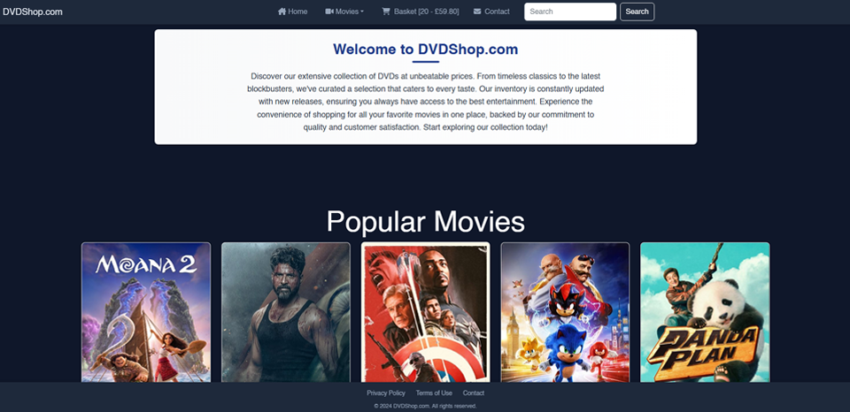

# DVD Shop

A modern e-commerce platform for movie enthusiasts, built with React.



## Live Demo

Visit the live site: [DVD Shop](https://dvdshop.jackscottow.com/)

## Features

- 🎬 Browse movies by genre
- 🔍 Search functionality
- 🛒 Shopping cart with persistent storage
- 💳 Checkout process
- 📱 Fully responsive design
- 🌙 Dark mode interface
- 🎯 Dynamic movie details from TMDB API
- 🔄 Real-time price calculations
- 📦 Add/remove items from cart

## Tech Stack

- React
- React Router
- Bootstrap
- TMDB API
- Local Storage
- CSS3
- FontAwesome Icons
- Swiper.js

## Getting Started

1. Clone the repository:

```bash
git clone https://github.com/yourusername/dvd-shop.git
```

2. Install dependencies:

```bash
cd dvd-shop
npm install
```

3. Create a `.env` file and add your TMDB API key:

```
REACT_APP_TMDB_API_KEY=your_api_key_here
```

4. Start the development server:

```bash
npm start
```

## Project Structure

```
src/
├── components/     # React components
├── Css/           # Component styles
├── Images/        # Static images
├── Layouts/       # Layout components
└── App.js         # Main application component
```

## API Integration

This project uses The Movie Database (TMDB) API to fetch movie data. You'll need to:

1. Create an account at [TMDB](https://www.themoviedb.org/)
2. Get an API key
3. Add it to your `.env` file

## Contributing

Contributions are welcome! Please feel free to submit a Pull Request.

## License

This project is licensed under the MIT License - see the [LICENSE](LICENSE) file for details.

## Acknowledgments

- Movie data provided by [The Movie Database (TMDB)](https://www.themoviedb.org/)
- Icons by [FontAwesome](https://fontawesome.com/)
- Carousel by [Swiper](https://swiperjs.com/)
