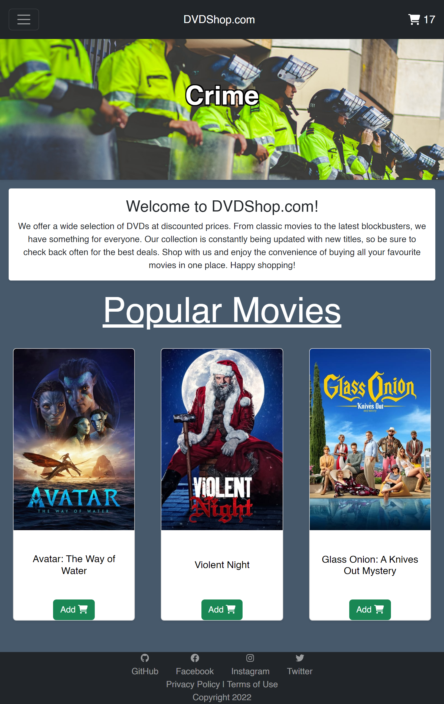

# "DVDShop" Store Frontend

An e-commerce frontend built with React, React Router & Bootstrap taking data from _"The Movie Database"_ API.

[Demo here](https://jackscottow.netlify.app/)

## Tech Stack

- React
- React Router
- Bootstrap
- Swiper.js
- React-Text-Transition
- FontAwesome

## Features

- Interactive shopping cart stored in local data for persistance
- Fully responsive on all screen sizes
- Data fetched from _"The Movie Database"_ for multiple categories
- Automatic pagination on scroll
